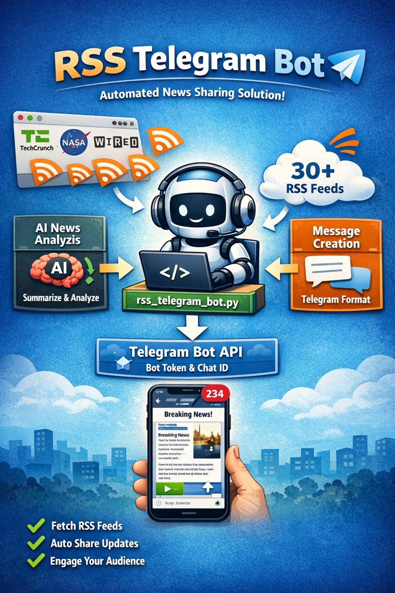

# 🤖 RSS Telegram Bot



**Your Personal News Assistant**

This bot automatically tracks news from 30+ websites (Technology, Science, Economics) and sends them to your Telegram channel. It can also analyze news using AI!

---

## ✨ Features

- 🌐 **30+ Sources:** TechCrunch, WIRED, NASA, Science, and more.
- ⚡ **Instant Updates:** Checks for news every 5 minutes.
- 🤖 **AI Analysis:** Detailed insights and summaries for each news item (Optional).
- 📊 **Daily Summary:** A neat summary of the day's news at 18:35.
- 🌍 **Multi-language Support:** Supports both international and local sources.

---

## 🚀 Super Easy Setup

You don't need to know any code! Just follow these 3 steps.

### 1. Get Your Keys
Before starting, you need two things from Telegram:

1.  **Bot Token:** Talk to [@BotFather](https://t.me/botfather), create a new bot (`/newbot`), and copy the **API Token**.
2.  **Chat ID:** Talk to [@userinfobot](https://t.me/userinfobot) and copy your **ID**.

*(Optional) For AI features, get a free key from [OpenRouter](https://openrouter.ai/).*

### 2. Download & Run

Open your terminal and run these commands:

```bash
# 1. Clone the project
git clone https://github.com/haliskoc/n8nalternativersstelegram-.git
cd n8nalternativersstelegram-

# 2. Run the setup script
chmod +x setup.sh
sudo ./setup.sh
```

The script will automatically detect your OS (Linux, macOS, Windows) and guide you through the installation.

### 3. Manage the Bot

Once installed, you can manage everything using the unified CLI tool. Just type:

```bash
sudo rsstelegram
```

This will open a menu where you can:
- 📰 **Manage Feeds:** Add, remove, or search for RSS feeds.
- 🔄 **Import/Export:** Import OPML files or export your current list.
- 🤖 **Bot Control:** Start, stop, restart, or view logs.
- ⚙️ **Settings:** Change your API keys or configuration.

### 4. Update

To update the bot to the latest version:
```bash
sudo rsstelegram
```
Select option **5. Update Application**.

### 🗑️ Uninstall
If you want to remove everything installed by the bot:
```bash
chmod +x uninstall.sh
sudo ./uninstall.sh
```

---

<details>
<summary>🛠️ <b>Advanced / Manual Setup (Click to Expand)</b></summary>

If you prefer to set up everything manually or want to know how it works under the hood.

### Requirements
- Docker & Docker Compose
- Or Python 3.8+

### Manual Docker Setup
1. Create a `.env` file:
   ```bash
   cp env.example .env
   ```
2. Edit `.env` and add your keys:
   ```
   TELEGRAM_TOKEN=your_token
   CHAT_ID=your_id
   OPENROUTER_API_KEY=your_key (optional)
   ```
3. Run with Docker Compose:
   ```bash
   docker-compose up -d
   ```

### Manual Python Setup
1. Install dependencies:
   ```bash
   pip install -r requirements.txt
   ```
2. Set environment variables:
   ```bash
   export TELEGRAM_TOKEN="your_token"
   export CHAT_ID="your_id"
   ```
3. Run the bot:
   ```bash
   python3 rss_telegram_bot.py
   ```

</details>
